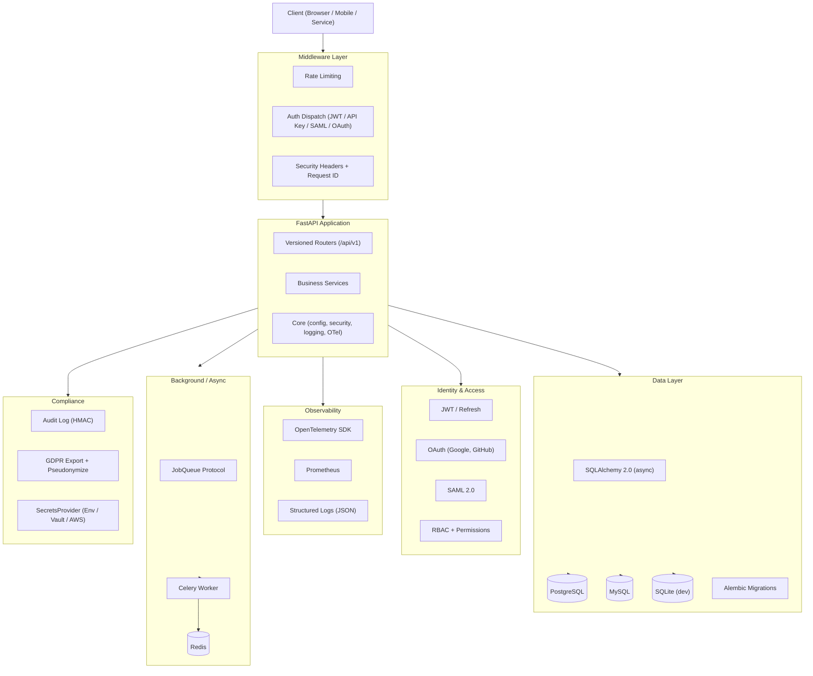

# fastapi-production-starter

> Enterprise FastAPI foundation.
> SAML. Multi-DB. OpenTelemetry. Audit logs. Zero-downtime migrations.
> All wired. All toggleable. Off by default.

[](https://github.com/HarounAbdelsamad/fastapi-production-starter/actions)
[](https://www.python.org/downloads/)
[](LICENSE)
[](docs/architecture/overview.md)

## Quickstart

```bash
git clone https://github.com/HarounAbdelsamad/fastapi-production-starter.git
cd fastapi-production-starter
make install
cp .env.example .env
make run
# API at http://127.0.0.1:8000  •  Docs at http://127.0.0.1:8000/docs
```

Full observability + identity stack (requires Docker):

```bash
make docker-up   # Postgres + Redis + Prometheus + Grafana + Jaeger (planned)
```

---

## How This Compares

| Feature | **this template** | tiangolo/full-stack-fastapi | vstorm-co | plain FastAPI |
|---|---|---|---|---|
| **Target audience** | Enterprise backend teams | Indie / startup full-stack | Indie SaaS / AI agents | Roll your own |
| **SAML 2.0 SSO** | ✓ (v0.1 roadmap) | ✗ | ✗ | ✗ |
| **Multi-DB** (Postgres/MySQL/SQLite) | ✓ CI-tested | Postgres only | Postgres only | — |
| **OpenTelemetry** | ✓ default | ✗ | ✗ | — |
| **Audit log** (HMAC-signed) | ✓ | ✗ | ✗ | — |
| **Pluggable secrets** (Vault / AWS) | ✓ protocol + adapters | ✗ | ✗ | — |
| **Zero-downtime migrations** | ✓ documented playbook | ✗ | ✗ | — |
| **Multi-tenancy** (row-level) | ✓ | ✗ | ✓ | — |
| **RBAC with hierarchy** | ✓ | basic | ✓ | — |
| **API key auth** | ✓ (v0.1 roadmap) | ✗ | ✗ | — |
| **Architecture Decision Records** | 12 ADRs | ✗ | ✗ | — |
| **Frontend included** | ✗ | ✓ React + Vite | ✗ | — |

**When to pick each:**

- **This template**: You are building a backend service for an enterprise environment, an internal platform, or a B2B product. You need SSO, compliance hooks, multi-DB, or serious observability. You will pair this with your existing frontend stack.
- **tiangolo's template**: You want a full-stack starter with a React frontend, PostgreSQL, and a working admin UI. Excellent for startup MVPs.
- **vstorm-co**: You want a SaaS boilerplate with billing and AI features out of the box.
- **plain FastAPI**: You want maximum control and will build your own structure.

---

## Who This Is For

**This template is for:**

- Backend leads at 50–500 person companies told to "pick our backend foundation"
- Platform teams building internal APIs on FastAPI
- Engineering consultancies standardizing client project backends
- Senior engineers evaluating "should we adopt this or build from scratch"

These people evaluate templates by cloning and running the test suite, reading the docs and ADRs, checking the issue tracker, and asking colleagues. This template is designed to survive that evaluation.

**This template is NOT for:**

- **Not full-stack.** Backend only. Pair with your choice of frontend.
- **Not a SaaS-in-a-box.** No billing logic, no checkout flows, no email templates.
- **Not for tutorials or hackathons.** Aimed at production systems.
- **Not opinionated about your deployment platform.** Cloud-agnostic.
- **Not an AI/ML starter.** AI integration may come in a future version; not the focus.
- **Not a "low-code" tool.** This is for engineers who want full control.

---

## Feature Reference

### Identity & Access

| Feature | Status | Toggle |
|---|---|---|
| JWT auth with refresh tokens | ✓ | always on |
| OAuth 2.0 (Google, GitHub) | ✓ | `OAUTH_*_ENABLED` |
| SAML 2.0 (Keycloak demo) | roadmap v0.1 | `SAML_ENABLED` |
| API key auth (issue / rotate / revoke) | roadmap v0.1 | — |
| RBAC with role hierarchy | ✓ | always on |
| Service-to-service auth | roadmap v0.1 | — |
| Password reset | ✓ | — |

### Data & Persistence

| Feature | Status | Notes |
|---|---|---|
| Multi-DB (Postgres / MySQL / SQLite) | ✓ | CI-tested; limitations documented |
| SQLAlchemy 2.0 + async sessions | ✓ | |
| Alembic migrations | ✓ | with downgrade support |
| Zero-downtime migration playbook | roadmap v0.1 | docs + helper utilities |
| Multi-tenancy (row-level isolation) | ✓ | see `docs/multi-tenancy.md` |
| Soft delete pattern | ✓ | optional |

### Observability

| Feature | Status | Toggle |
|---|---|---|
| OpenTelemetry (traces + metrics + logs) | ✓ | noop by default; set `OTLP_ENDPOINT` to export |
| Prometheus metrics | ✓ | `METRICS_ENABLED` |
| Structured JSON logging | ✓ | always on |
| Trace ID in every log line | ✓ | always on |
| Health endpoints (`/health/live`, `/health/ready`) | ✓ | always on |
| Grafana dashboard | roadmap v0.1 | |

### Compliance & Security

| Feature | Status | Notes |
|---|---|---|
| Audit log (HMAC-SHA256 signed) | ✓ | append-only; export endpoint included |
| Security headers (CSP, HSTS, X-Frame) | ✓ | always on |
| Rate limiting (per-IP, per-tenant) | ✓ | `RATE_LIMIT_ENABLED` |
| PII field tagging + log redaction | ✓ | model decorator |
| GDPR data export endpoint | ✓ | |
| GDPR pseudonymization helpers | ✓ | |
| Input validation (beyond Pydantic) | ✓ | denylist patterns |

### Operations

| Feature | Status | Notes |
|---|---|---|
| Background jobs (Celery default, RQ adapter) | ✓ | `CELERY_ENABLED` |
| Feature flags (runtime, per-tenant) | ✓ | `FEATURE_FLAGS_ENABLED` |
| Redis cache | ✓ | `CACHE_ENABLED` |
| WebSocket support | ✓ | `WEBSOCKET_ENABLED` |
| File storage (local / S3) | ✓ | `STORAGE_BACKEND` |
| Idempotency keys | roadmap v0.1 | |
| Circuit breakers | roadmap v0.1 | |
| Outgoing webhooks | roadmap v0.1 | |

---

## Architecture



See [`docs/architecture/overview.md`](docs/architecture/overview.md) for the full description.

---

## Architecture Decision Records

Major design choices are documented as ADRs in [`docs/adr/`](docs/adr/):

| ADR | Decision |
|---|---|
| [ADR-001](docs/adr/001-why-fastapi.md) | Why FastAPI over Flask, Django, Litestar |
| [ADR-002](docs/adr/002-why-sqlalchemy-2.md) | Why SQLAlchemy 2.0 |
| [ADR-003](docs/adr/003-multi-db-support.md) | Multi-DB support boundaries |
| [ADR-004](docs/adr/004-pluggable-secrets.md) | Pluggable secret backend protocol |
| [ADR-005](docs/adr/005-multi-tenancy.md) | Multi-tenancy strategy (row-level) |
| [ADR-006](docs/adr/006-saml-library.md) | SAML library choice (python3-saml) |
| [ADR-007](docs/adr/007-opentelemetry-default.md) | OpenTelemetry wired in by default |
| [ADR-008](docs/adr/008-audit-log.md) | Audit log signing and storage |
| [ADR-009](docs/adr/009-background-jobs-protocol.md) | Background jobs as a protocol |
| [ADR-010](docs/adr/010-no-frontend.md) | Why no frontend |
| [ADR-011](docs/adr/011-toggleable-features.md) | Env-time vs runtime toggles |
| [ADR-012](docs/adr/012-versioning-compatibility.md) | Versioning and API compatibility |

---

## Roadmap

**v0.1.0** (in progress):

- [ ] SAML 2.0 with Keycloak demo IdP
- [ ] API key auth (issue, rotate, revoke)
- [ ] Zero-downtime migration playbook and helpers
- [ ] Service-to-service auth pattern
- [ ] Grafana dashboard JSON
- [ ] CI matrix: Postgres / MySQL / SQLite
- [ ] MkDocs documentation site

**v0.2.0** (planned):

- SCIM provisioning hooks
- gRPC support
- Kubernetes reference deployment YAMLs
- Azure AD / Entra ID SAML integration guide

**Explicitly deferred** (not planned for core):

- Frontend
- Billing provider (Stripe, etc.)
- Email provider (SES, Resend, SendGrid)
- AI/NLP features
- GraphQL

---

## Core Endpoints

```
GET  /health/live           — process is running
GET  /health/ready          — process can serve traffic
GET  /metrics               — Prometheus metrics (METRICS_ENABLED=true)

POST /api/v1/auth/login
POST /api/v1/auth/refresh
POST /api/v1/auth/logout
POST /api/v1/auth/password-reset/request
POST /api/v1/auth/password-reset/confirm

GET|POST|PATCH|DELETE /api/v1/users/...
GET  /api/v1/admin/dashboard
GET  /api/v1/admin/audit-logs
GET|PUT /api/v1/admin/features/...
POST /api/v1/files/upload
```

---

## Developer Workflow

```bash
make install          # install deps with uv
make run              # start dev server
make test             # run test suite
make test-cov         # test with coverage report
make lint             # ruff check
make format-check     # ruff format --check
make migrate          # alembic upgrade head
make docker-up        # start Postgres + Redis + observability stack
make check-config     # validate config for current .env
```

CLI utilities:

```bash
uv run cli generate-secret          # generate a random secret key
uv run cli seed                     # seed dev database
uv run cli create-admin --email ...  # create an admin user
```

---

## Documentation

- [`docs/architecture/overview.md`](docs/architecture/overview.md) — system architecture and layer descriptions
- [`docs/architecture/decisions.md`](docs/architecture/decisions.md) — ADR index
- [`docs/adr/`](docs/adr/) — all 12 Architecture Decision Records
- [`docs/multi-tenancy.md`](docs/multi-tenancy.md) — multi-tenancy pattern
- [`docs/oauth.md`](docs/oauth.md) — OAuth provider setup
- [`docs/deployment.md`](docs/deployment.md) — deployment guide
- [`docs/migration-from-tiangolo.md`](docs/migration-from-tiangolo.md) — migrating from tiangolo's full-stack template

---

## Contributing

See [`CONTRIBUTING.md`](CONTRIBUTING.md). Contributions that add Postgres-specific code paths without a multi-DB test will be declined — this is the most common way to break the multi-DB guarantee.

## Security

Report vulnerabilities via the [GitHub Security Advisory](https://github.com/HarounAbdelsamad/fastapi-production-starter/security/advisories/new) process. Do not open public issues for security bugs.

## License

[MIT](LICENSE)
