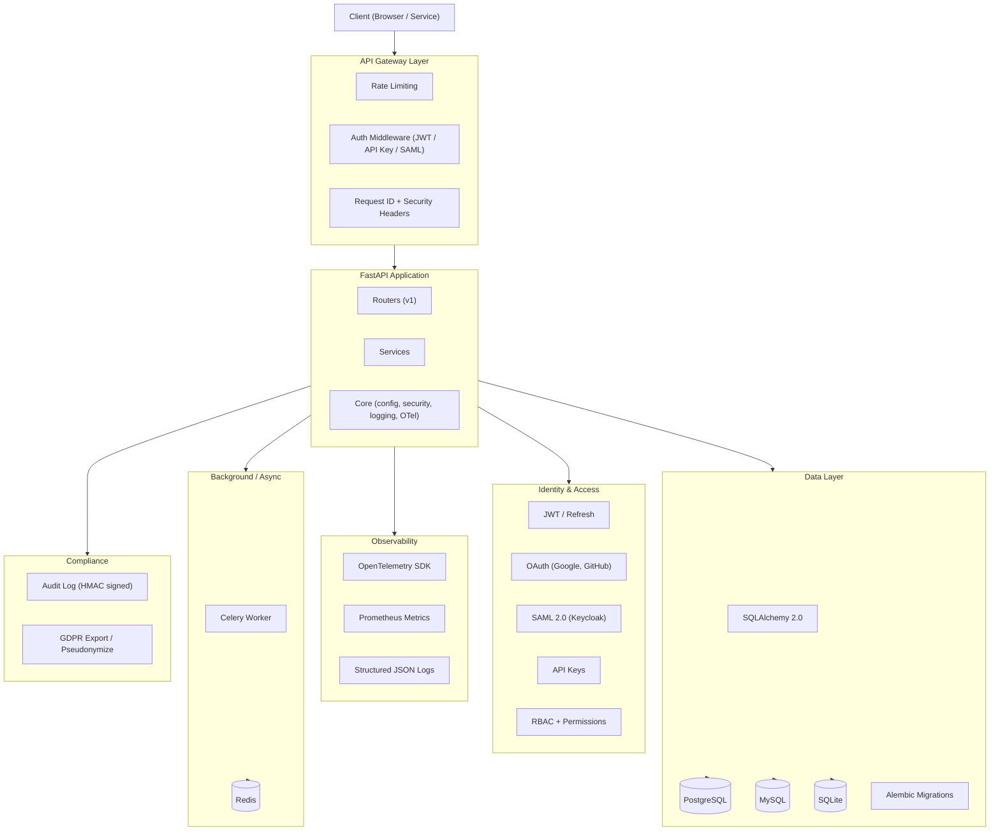

# Architecture Overview

> **Placeholder** — this diagram will be replaced with a detailed architecture diagram in Phase 1.

## Layer Descriptions

| Layer | Responsibility |
|---|---|
| API Gateway | Rate limiting, auth dispatch, request enrichment |
| FastAPI Application | Routing, business logic, dependency injection |
| Identity & Access | Multi-IdP auth, RBAC, API key lifecycle |
| Data Layer | Multi-DB abstraction, zero-downtime migrations |
| Observability | Traces, metrics, structured logs — OTel by default |
| Background | Async task queue (Celery default, RQ adapter sketch) |
| Compliance | Audit log, GDPR helpers, PII field tagging |

All features are **toggleable via environment variables** and off by default in development.
