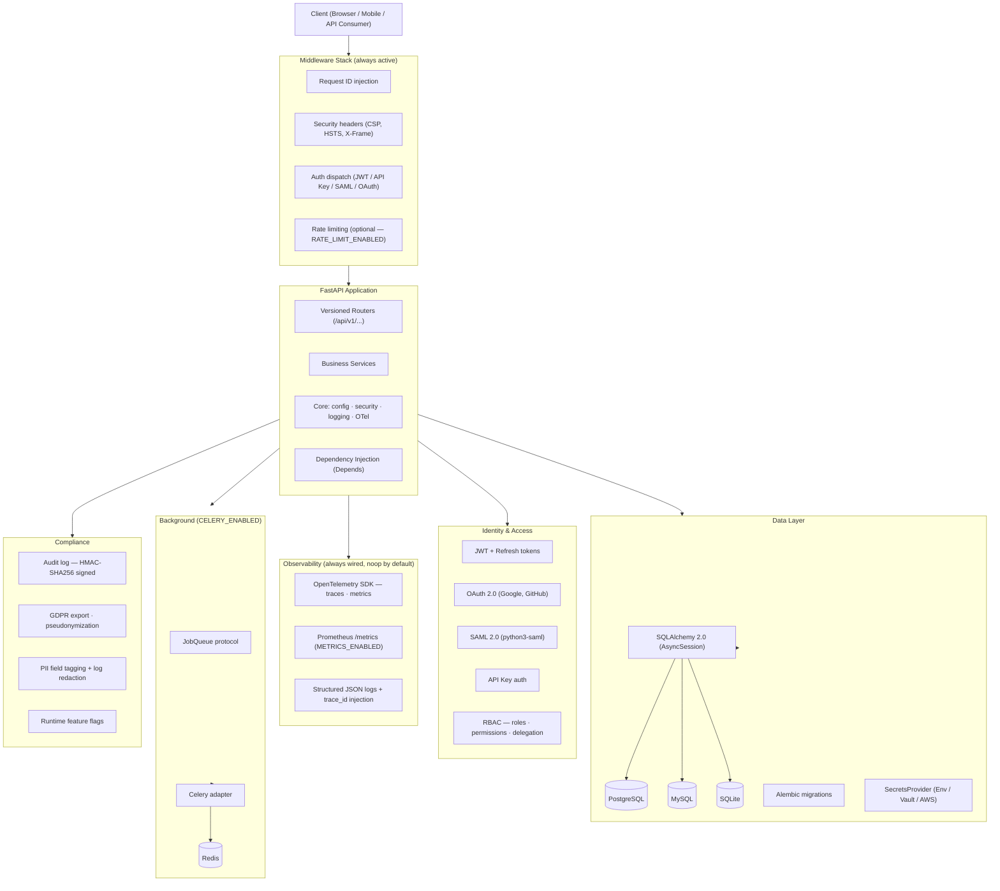
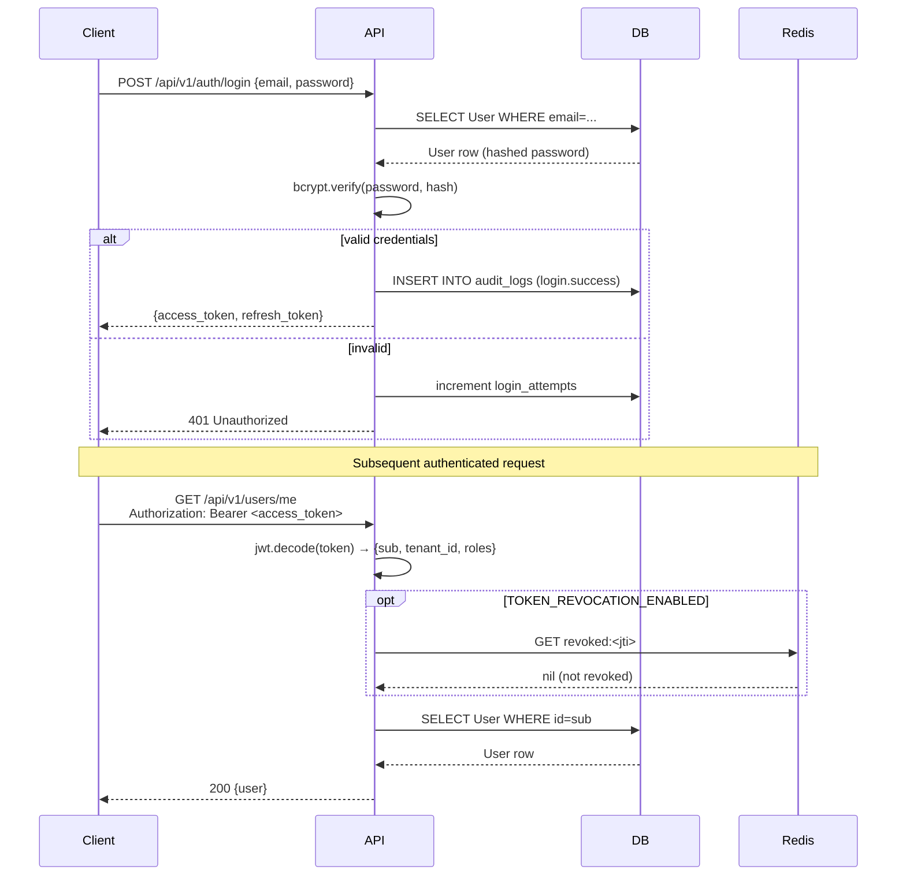
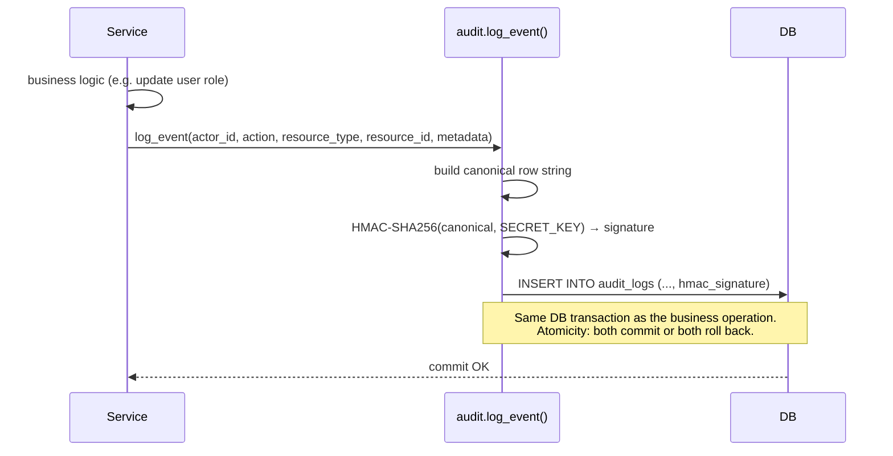

# Architecture Overview

`fastapi-production-starter` is structured as a layered FastAPI application. Each layer has a single responsibility. Features are toggleable via environment variables; the core request path runs without any optional dependency enabled.

## System Diagram



## Sequence Diagrams

### JWT Login & Authenticated Request



### Audit Log Write Path



## Request Lifecycle

A typical authenticated API request flows through:

1. **Middleware stack** — request ID assigned; security headers set; JWT verified; tenant extracted from token claims; rate limit checked
2. **Router** — path matched; path/query parameters validated by Pydantic
3. **Dependencies** — DB session opened (`AsyncSession`); tenant context injected; RBAC permission checked
4. **Service** — business logic executed; DB queries issued via SQLAlchemy; background jobs enqueued if needed
5. **Audit log** — material write operations emit an audit entry (async, within the same DB transaction)
6. **OTel span** — span closed; trace ID injected into response header and log entries
7. **Response** — Pydantic model serialized to JSON; DB session committed and closed

## Layer Descriptions

### Middleware Stack

Always active — no toggles. Runs before routing.

| Middleware | Purpose |
|---|---|
| `RequestIDMiddleware` | Assigns `X-Request-ID` (generates if absent). Injected into every log entry. |
| `SecurityHeadersMiddleware` | Sets CSP, HSTS, X-Frame-Options, X-Content-Type-Options, Referrer-Policy. Each header's rationale is documented in the source. |
| `AuthMiddleware` | Verifies credentials and attaches the authenticated principal to request state. Supports JWT, API keys, and (when enabled) SAML assertions. |
| `TenantMiddleware` | Extracts `tenant_id` from the JWT claim and attaches a `TenantContext` to request state. |
| `RateLimitMiddleware` | Per-IP and per-tenant rate limiting backed by Redis. Active when `RATE_LIMIT_ENABLED=true`. |

### FastAPI Application

Core routing and DI. Standard FastAPI patterns throughout.

- Routers are versioned under `/api/v1/` — add `/api/v2/` when breaking changes are needed (see [ADR-012](../adr/012-versioning-compatibility.md))
- Services receive dependencies (DB session, tenant context, secrets, job queue) via `Depends()`
- No global state — all per-request state is carried in `Request.state` or injected dependencies

### Identity & Access

All auth paths terminate here. JWTs carry `sub` (user ID), `tenant_id`, and `roles`. The `Depends(get_current_user)` dependency is the single gate — every protected route uses it.

RBAC is explicit: permissions are stored in the DB, not hardcoded in routes. Adding a new permission requires an Alembic migration and a check in the relevant service, not a code annotation on the route.

### Data Layer

SQLAlchemy 2.0 with `AsyncSession`. One session per request, created by `Depends(get_db)` and closed in the dependency's `finally` block.

The `SecretsProvider` (see [ADR-004](../adr/004-pluggable-secrets.md)) resolves credentials at startup. The DB URL is never read directly from `os.environ` in service code — it flows through `settings.DATABASE_URL` which was resolved by the secrets provider.

### Observability

OpenTelemetry is initialized at application startup (via the `lifespan` handler) regardless of whether an exporter is configured. The noop exporter discards spans with near-zero overhead. Set `OTLP_ENDPOINT` to export traces to Jaeger, Grafana Tempo, Honeycomb, or any OTLP-compatible backend.

The trace ID from the current span is injected into:
- Every structured log entry (`trace_id`, `span_id` fields)
- The `X-Trace-ID` response header
- Downstream HTTP calls via W3C `traceparent` header

### Background Jobs

The `JobQueue` protocol (see [ADR-009](../adr/009-background-jobs-protocol.md)) decouples job dispatch from the queue implementation. The Celery adapter is the default. Add `CELERY_ENABLED=true` and `REDIS_URL` to activate.

### Compliance

Audit logging, GDPR helpers, and runtime feature flags live here. The audit log writes within the same DB transaction as the business operation — atomicity is guaranteed. The feature flag service reads from DB with a Redis cache layer.

## Directory Structure

```
app/
├── core/              # config, security utilities, logging setup, OTel init
├── db/                # async engine, session factory, base model
├── models/            # SQLAlchemy ORM models
├── schemas/           # Pydantic request/response schemas
├── services/          # business logic (auth, users, tenants, audit, flags)
├── routers/           # FastAPI route handlers (v1/)
├── middleware/        # request ID, security headers, auth, rate limit
└── main.py            # FastAPI app factory + lifespan handler

alembic/               # migration scripts + env.py
docs/
├── adr/               # 12 Architecture Decision Records
├── architecture/      # this file + decisions index
├── deployment.md
├── multi-tenancy.md
├── oauth.md
└── migration-from-tiangolo.md
tests/
├── unit/
├── integration/
└── conftest.py
```

## Key Design Principles

**Explicit over magic.** Tenant filtering is passed as a parameter, not automatically applied. RBAC checks are explicit calls in service code, not route decorators. This makes authorization logic grep-able and auditable.

**Fail loudly at startup.** If `CACHE_ENABLED=true` but `REDIS_URL` is not set, the app raises at startup with a clear error. Silent runtime failures are worse than loud startup failures.

**Toggleable but not removable.** Features can be disabled, but their code is always present. This ensures disabled features remain tested and integrated — not rotting dead code.

**One pattern per concern.** There is one way to do auth, one way to do DB access, one way to emit audit events. Consistency reduces the surface area for bugs.
