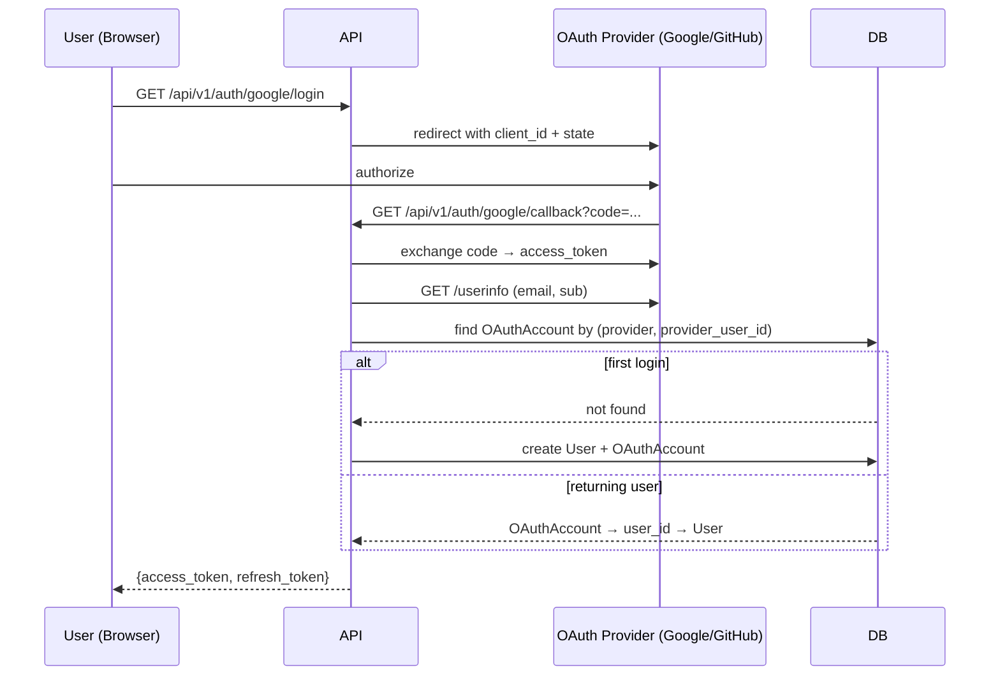

# OAuth 2.0 / OpenID Connect

Google and GitHub are supported out of the box. Adding a new provider takes ~40 lines.

## How the flow works



## Configuration

```env
OAUTH_GOOGLE_CLIENT_ID=your-google-client-id
OAUTH_GOOGLE_CLIENT_SECRET=your-google-client-secret

OAUTH_GITHUB_CLIENT_ID=your-github-client-id
OAUTH_GITHUB_CLIENT_SECRET=your-github-client-secret
```

Configure redirect URIs in the provider console:
- Google: `http://localhost:8000/api/v1/auth/google/callback`
- GitHub: `http://localhost:8000/api/v1/auth/github/callback`

## Adding a new provider in ~40 lines

**1. Register the client in `app/core/oauth.py`:**

```python
if settings.OAUTH_ACME_CLIENT_ID:
    oauth.register(
        name="acme",
        client_id=settings.OAUTH_ACME_CLIENT_ID,
        client_secret=settings.OAUTH_ACME_CLIENT_SECRET,
        server_metadata_url="https://acme.example.com/.well-known/openid-configuration",
        client_kwargs={"scope": "openid email profile"},
    )
```

**2. Add settings in `app/core/config.py`:**

```python
OAUTH_ACME_CLIENT_ID: str = ""
OAUTH_ACME_CLIENT_SECRET: str = ""
```

**3. Add login + callback routes in `app/routers/oauth.py`:**

```python
@router.get("/acme/login")
async def acme_login(request: Request):
    client = configure_oauth().create_client("acme")
    return await client.authorize_redirect(request, request.url_for("acme_callback"))

@router.get("/acme/callback", name="acme_callback")
async def acme_callback(request: Request, db: AsyncSession = Depends(get_session)):
    client = configure_oauth().create_client("acme")
    token = await client.authorize_access_token(request)
    userinfo = token.get("userinfo") or await client.userinfo(token=token)

    user, _ = await get_or_create_oauth_user(
        db,
        provider="acme",
        provider_user_id=str(userinfo["sub"]),
        email=userinfo["email"],
        username=userinfo.get("name", userinfo["email"].split("@")[0]),
    )
    return JSONResponse(content={
        "access_token": create_access_token(user.user_id),
        "refresh_token": create_refresh_token(user.user_id),
        "token_type": "bearer",
    })
```

**4. Wire in `app/main.py`** (already handled — the oauth router is always included when any OAuth client ID is set).

## OAuthAccount model

The `oauth_accounts` table links provider identities to local users:

```
oauth_accounts
──────────────
account_id (PK)
user_id → users
provider          "google" | "github" | "saml" | ...
provider_user_id  stable identifier from the provider (Google sub, GitHub id)
provider_email
provider_username
created_at / updated_at
```

A user can have multiple OAuth accounts (e.g., linked Google + GitHub). The `(provider, provider_user_id)` pair is unique.

## User provisioning

On first OAuth login:
1. A new `User` is created with a random password (not usable for password login)
2. The `username` is derived from the provider's display name (lowercased, deduplicated)
3. An `OAuthAccount` row links the provider identity to the user
4. Subsequent logins from the same provider identity retrieve the existing user
