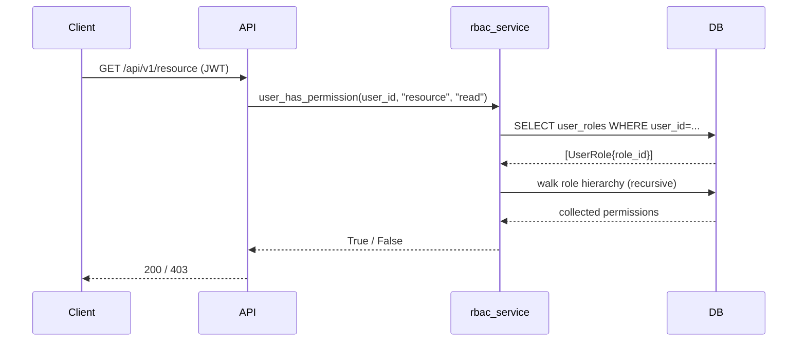

# Role-Based Access Control (RBAC)

Hierarchical RBAC with DB-backed role and permission tables. Backward compatible with the legacy `User.role` string.

## Data model

```
roles           permissions          role_permissions
──────          ────────────         ────────────────
role_id (PK)    permission_id (PK)   role_id  →  roles
name (unique)   resource             permission_id  →  permissions
description     action
parent_role_id  description          user_roles
  └─ FK → roles                      ──────────
                                      user_id
                                      role_id  →  roles
                                      granted_by
                                      granted_at
```

## Hierarchy

Parent roles **inherit** their children's permissions. Example:

```
user       → self:read, self:write, api-keys:read
  └─ manager → users:read, users:write, roles:read
       └─ admin → *:* (wildcard)
```

An admin role with `parent_role_id → manager` resolves: admin's own perms + manager's + user's.

## Sequence diagram



## Endpoints (admin only)

| Method | Path | Description |
|--------|------|-------------|
| `GET` | `/api/v1/roles` | List all roles |
| `POST` | `/api/v1/roles` | Create a role |
| `GET` | `/api/v1/users/{user_id}/roles` | List roles for user |
| `POST` | `/api/v1/users/{user_id}/roles` | Grant role to user |
| `DELETE` | `/api/v1/users/{user_id}/roles/{role_id}` | Revoke role |
| `GET` | `/api/v1/users/{user_id}/permissions` | Resolved permission set |

## Using `require_permission`

```python
from app.core.permissions import require_permission

@router.get("/reports")
async def get_reports(
    user: User = Depends(require_permission("reports", "read"))
):
    ...
```

Resolves through the full hierarchy. Falls back to built-in role mapping when no `UserRole` rows exist for the user (backward compat).

## Built-in fallback permissions

| Role | Permissions |
|------|-------------|
| `admin` | `*:*` (wildcard) |
| `manager` | `users:read users:write api-keys:read roles:read` |
| `user` | `self:read self:write api-keys:read` |
| `service-account` | `*:*` |

## Delegation

Admins can grant roles they own to other users. The `granted_by` field tracks who made the assignment for audit purposes. To restrict delegation (an admin can only grant roles with permissions ≤ their own), implement a pre-grant check in `rbac_service.grant_role`.
