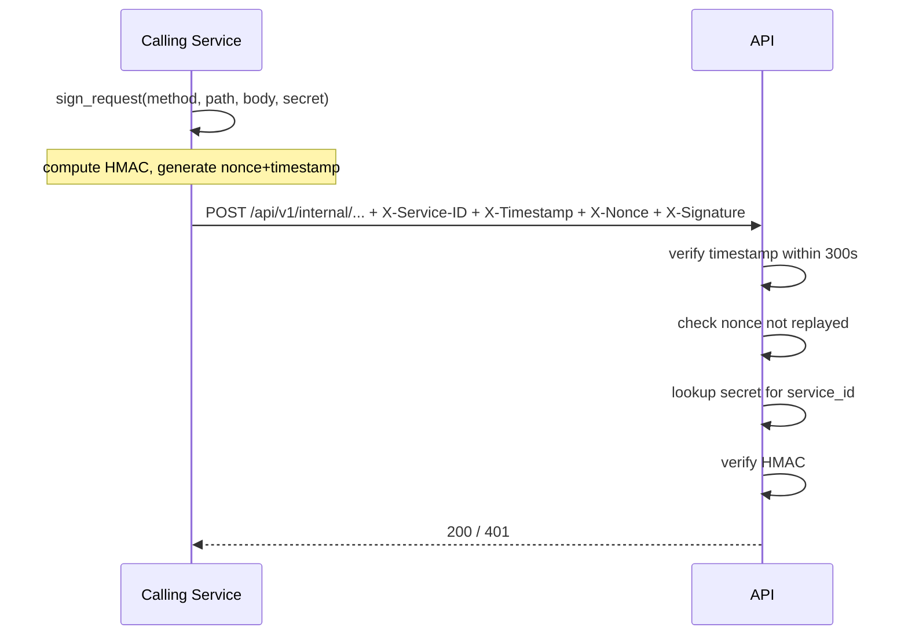

# Service-to-Service Authentication

HMAC-SHA256 signed requests for machine-to-machine calls. No user session required.

## When to use

- Internal microservices calling each other
- Background workers calling protected endpoints
- Batch jobs or data pipelines

## How it works

Each service has a `service_id` (string name) and a `shared_secret` stored in `S2S_SERVICES`.

### Canonical message

```
{METHOD}\n{PATH}\n{TIMESTAMP}\n{NONCE}[\n{SHA256(body)}]
```

Body hash is included only when the request has a non-empty body. The signature is `HMAC-SHA256(secret, canonical_message).hexdigest()`.

### Required headers

| Header | Example | Description |
|--------|---------|-------------|
| `X-Service-ID` | `analytics-service` | Identifies the caller |
| `X-Timestamp` | `1714934400` | Unix timestamp (seconds) |
| `X-Nonce` | `a3f8bc2d...` | Random hex; prevents replay |
| `X-Signature` | `deadbeef...` | HMAC-SHA256 hex digest |

## Configuration

```env
S2S_ENABLED=true
S2S_SERVICES={"analytics-service": "super-secret-key", "worker": "another-secret"}
```

## Signing an outgoing request (Python)

```python
from app.core.s2s import sign_request
import httpx

body = b'{"task_id": "123"}'
headers = sign_request(
    method="POST",
    path="/api/v1/tasks/complete",
    body=body,
    service_id="analytics-service",
    secret="super-secret-key",
)
# Merge with other headers
httpx.post("http://api:8000/api/v1/tasks/complete", content=body, headers=headers)
```

## Protecting an endpoint

```python
from app.core.s2s import verify_s2s_signature

@router.post("/internal/trigger")
async def trigger(service_id: str = Depends(verify_s2s_signature)):
    # service_id is the verified caller name
    ...
```

## Security properties

- **Timestamp tolerance**: 300 seconds. Requests older than 5 minutes are rejected.
- **Nonce reuse**: Nonces are stored in memory for the tolerance window. In multi-instance deployments, replace the in-memory nonce store with Redis `SETEX`.
- **Secret rotation**: Update `S2S_SERVICES` and rotate secrets without downtime by briefly accepting both old and new secrets (implement in `verify_s2s_signature` if needed).

## mTLS alternative

For higher assurance, replace HMAC signed requests with mutual TLS:

1. Issue a client certificate to each service (internal CA or cert-manager)
2. Configure nginx/Envoy to require client cert on the internal endpoint
3. Pass the verified `CN` as a header to the application

HMAC is simpler to operate; mTLS is appropriate for regulated environments where key compromise risk justifies the PKI overhead.

## Sequence diagram


