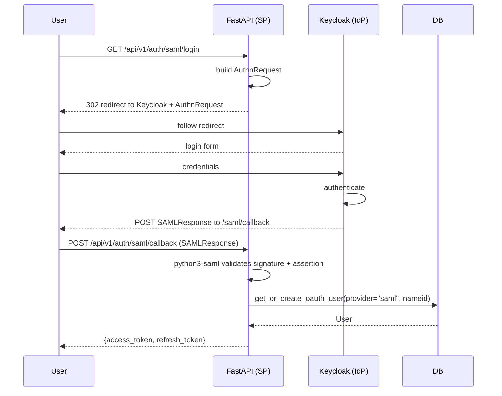

# SAML 2.0 Setup with Keycloak

End-to-end guide for SP-initiated SSO using Keycloak as the demo IdP.

## Prerequisites

- Docker Compose (for Keycloak)
- `xmlsec1` system library (for python3-saml on Linux)
- `python3-saml` optional extra installed

## Installation

```bash
# Ubuntu / Debian (CI and Docker)
apt-get install -y xmlsec1 libxmlsec1-dev pkg-config

# Install the optional SAML extra
uv sync --extra saml
```

> **Windows development**: Use Docker for SAML testing. The Python SAML processing runs inside the API container (Linux). SAML unit tests mock the library and run without xmlsec1.

## Start the demo stack

```bash
docker compose --profile saml up -d
```

This starts:
- FastAPI API on `http://localhost:8000`
- Keycloak on `http://localhost:8080`

## Configure Keycloak

### 1. Log in to admin UI

Open `http://localhost:8080` → admin / admin

### 2. Create a realm

1. Top-left dropdown → **Create realm**
2. Name: `demo`, Enable → **Create**

### 3. Create a SAML client

1. Left menu → **Clients** → **Create client**
2. Client type: **SAML**
3. Client ID: `http://localhost:8000/api/v1/auth/saml/metadata`
4. Next → Root URL: `http://localhost:8000`
5. Valid redirect URIs: `http://localhost:8000/api/v1/auth/saml/callback`
6. Save

### 4. Configure the client

Under **Settings**:
- Name ID format: `email`
- Force POST binding: ON

Under **Keys**:
- Turn off "Client signature required" (for simpler demo)

### 5. Get IdP metadata

Navigate to: `http://localhost:8080/realms/demo/protocol/saml/descriptor`

Copy:
- `entityID` attribute → `SAML_IDP_ENTITY_ID`
- `Location` of `SingleSignOnService` → `SAML_IDP_SSO_URL`
- `X509Certificate` content → `SAML_IDP_CERT` (paste the cert string, no header/footer lines)

### 6. Configure the application

```env
SAML_ENABLED=true
BASE_URL=http://localhost:8000
SAML_IDP_ENTITY_ID=http://localhost:8080/realms/demo
SAML_IDP_SSO_URL=http://localhost:8080/realms/demo/protocol/saml
SAML_IDP_SLO_URL=http://localhost:8080/realms/demo/protocol/saml
SAML_IDP_CERT=MIICmzCCAYMCBgF...   # from Keycloak metadata
```

### 7. Create a test user

In Keycloak → **Users** → **Add user**
- Username: `testuser@example.com`
- Email: `testuser@example.com`
- First name / Last name
- **Credentials** → Set password → temporary OFF

## Test the flow

```bash
# 1. Start the SP-initiated flow
curl -v http://localhost:8000/api/v1/auth/saml/login
# → 302 redirect to Keycloak

# 2. In browser: open http://localhost:8000/api/v1/auth/saml/login
# → Keycloak login page → authenticate → redirected back with SAMLResponse
# → API returns JSON with access_token + refresh_token

# 3. Use the token
curl http://localhost:8000/api/v1/users/me \
  -H "Authorization: Bearer <access_token>"
```

## Verify SP metadata

```bash
curl http://localhost:8000/api/v1/auth/saml/metadata
```

Should return XML. Register this URL (or upload the XML) in Keycloak under **Client** → **Import metadata** if you prefer metadata-driven configuration.

## Sequence diagram



## Attribute mapping

The callback extracts these attributes from the SAML assertion (in priority order):

| Field | Checked attributes |
|-------|--------------------|
| email | `email`, WS-Fed email claim, NameID |
| username | `username`, WS-Fed name claim, email prefix |

Configure Keycloak attribute mappers to expose these under those names.

## Production checklist

- [ ] Use HTTPS for both SP and IdP (`BASE_URL=https://...`)
- [ ] Set `SAML_SP_CERT` and `SAML_SP_KEY` so AuthnRequests are signed
- [ ] Rotate `SAML_IDP_CERT` annually using the dual-cert approach
- [ ] Set `strict: true` in SAML settings (already the default)
- [ ] Limit `Valid redirect URIs` in Keycloak to your production domain
